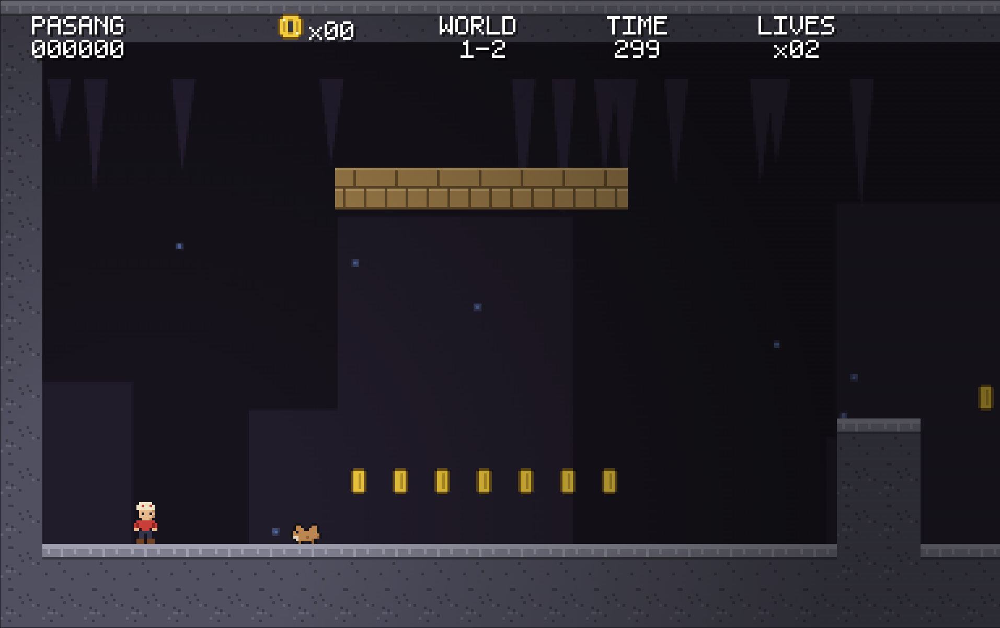

# Pasang — A Himalayan Adventure

> Built entirely by [Claude Code](https://claude.ai/code) from [a single prompt](prompt.md).

A complete 2D side-scrolling platformer set in the Nepali Himalayas, inspired by the
classic Super Mario games. **Fully playable: 3 worlds, 12 levels, 3 boss fights, and
an original soundtrack — all in plain HTML5/JavaScript with zero dependencies.**

You play as **Pasang**, a young Sherpa climbing from the foothills to the high passes
to rescue his sister **Maya** from the **Yeti**. Run, jump, and climb through terraced
farms, prayer-flag-lined trails, monasteries, and icy ridgelines. Dodge yaks, leap
across suspension bridges, eat momos, sip chiya, throw khukuris, and ring the bell at
the top of each level.



## How to play (plug-and-play)

No build step, no dependencies. Pick whichever is easiest:

```bash
# Option 1 — any Python (most machines have it)
python3 -m http.server 8000
# then open http://localhost:8000

# Option 2 — Node.js
npx serve .
# then open the printed URL

# Option 3 — npm
npm start
```

**Or simply double-click `index.html`** — the game runs straight off the
filesystem in any modern browser.

### Controls

| Action | Keys |
|---|---|
| Move | Arrow keys or WASD |
| Jump (hold for higher) | Z, J, or Space |
| Run / throw khukuri | X, K, or Shift |
| Crouch / enter wells | Down or S |
| Pause / start | Enter |
| Mute | M |

On touch devices, on-screen controls appear automatically.

## The game

- **3 worlds, 12 levels** — the Foothills, the Monastery Hills, and the High Passes,
  plus hidden bonus caves reached through stone wells.
- **Power-ups from Nepali staples** — a **momo** makes you big, a **khukuri** lets you
  throw spinning blades, **chiya** (butter tea) grants an invincible Himalayan Rush,
  and a golden **sel roti** is an extra life.
- **Original wildlife and folklore foes** — grumpy yaks, scurrying pikas, langur
  monkeys that curl into rolling balls, swooping goraks, snapping rhododendrons,
  pouncing snow leopards, and frost spirits.
- **Boss battles** — the charging **Bandit Boar**, the leaping **Langur King**, and a
  final showdown with the **Yeti** on a suspension bridge with a rope-release lever.
- **Classic structure** — prayer blocks, breakable stone bricks, hidden blocks, coins
  (100 = extra life), checkpoints at spinning prayer wheels, a level timer with hurry
  music, score combos, springboard drums, rope lifts, crumbling planks, flame chains,
  stone slab crushers, slippery ice, and a goal bell whose ring is worth more the
  higher you hit it.
- **Original chiptune soundtrack** — 12 Nepali-folk-flavored tracks and 30+ sound
  effects, synthesized live with WebAudio. Original pixel art drawn entirely in code.
- **Progress saves automatically** (localStorage): unlocked levels, best score, and
  your mute preference survive reloads.

## Development

Everything is hand-written vanilla JavaScript — no engine, no bundler.

```
index.html        entry point (script tags in dependency order)
js/               engine + game (sprites, audio, physics, levels, scenes)
test/             headless-browser tests (Playwright)
docs/PLAN.md      full design document
```

To run the automated tests (the only thing that needs npm):

```bash
npm install        # installs playwright (dev-only)
npm test           # smoke test: boots the game, plays 1-1, checks all levels
node test/flow.test.js   # deep test: wells, power-ups, all 3 bosses, ending
```

## Contributing

Contributions are welcome. By submitting a contribution, you agree it is licensed
under the Apache License 2.0 (see [LICENSE](LICENSE)).

## Legal

Pasang is an original work. All characters, names, artwork, audio, and level designs
in this project are original creations or are drawn from Nepali culture and Himalayan
folklore.

Super Mario and Mario are trademarks of Nintendo Co., Ltd. The reference above is
purely descriptive, to indicate the genre and inspiration of this game. Pasang is not
affiliated with, sponsored by, or endorsed by Nintendo, and it does not include or
reproduce any Nintendo assets, characters, or other third-party copyrighted material.

## License

Licensed under the Apache License, Version 2.0. See [LICENSE](LICENSE) for the full text.
